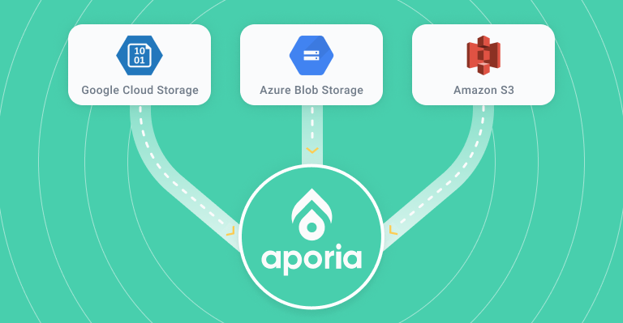

# 🏋️‍♀️ Aporia Importer


A small utility to import ML production data from your cloud storage provider and monitor it using [Aporia's monitoring platform](https://www.aporia.com/).



## Installation
```
pip install "aporia-importer[all]"
```

If you only wish to install the dependencies for a specific cloud provider, you can use
```
pip install "aporia-importer[s3]"
```

## Usage
```
aporia-importer /path/to/config.yaml
```

`aporia-importer` requires a config file as a parameter, see [configuration](#configuration)

## Configuration
`aporia-importer` uses a YAML configuration file.
There are sample configurations in the [examples](./examples) directory.

Currently, the configuration requires defining a model version schema manually - the schema is a mapping of field names to field types (see [here](https://app.aporia.com/docs/getting-started/concepts/#field-types)). You can find more details [in our docs](https://app.aporia.com/docs/getting-started/integrate-your-ml-model/#step-3-create-model-version).

The following table describes all of the configuration fields in detail:
| Field | Required | Description
| - | - | -
| source | True | The path to the files you wish to upload, e.g. s3://my-bucket/my_file.csv. Glob patterns are supported.
| format | True | The format of the files you wish to upload, see [here](#supported-data-formats)
| token | True | Your Aporia authentication token
| environment | True | The environment in which Aporia will be initialized (e.g production, staging)
| model_id | True | The ID of the [model](https://app.aporia.com/docs/getting-started/concepts/#models) that the data is associated with
| model_version.name | True | A name for the [model version](https://app.aporia.com/docs/getting-started/concepts/#model-version-schema) to create
| model_version.type | True | The [type](https://app.aporia.com/docs/getting-started/concepts/#model-types) of the model (regression, binary, multiclass)
| predictions | True | A mapping of [prediction fields](https://app.aporia.com/docs/getting-started/concepts/#predictions) to their field types
| features | True | A mapping of [feature fields](https://app.aporia.com/docs/getting-started/concepts/#features) to their field types
| raw_inputs | False | A mapping of [raw inputs fields](https://app.aporia.com/docs/getting-started/concepts/#raw-inputs) to their field types
| aporia_host | False | Aporia server URL. Defaults to app.aporia.com
| aporia_port | False | Aporia server port. Defaults to 443

## Supported Data Sources
* Local files
* S3

## Supported Data Formats
* csv
* parquet

## How does it work?
`aporia-importer` uses [dask](https://github.com/dask/dask) to load data from various cloud providers, and the [Aporia sdk](https://app.aporia.com/docs/getting-started/integrate-your-ml-model/#step-2-initialize-the-aporia-sdk) to report the data to Aporia.
